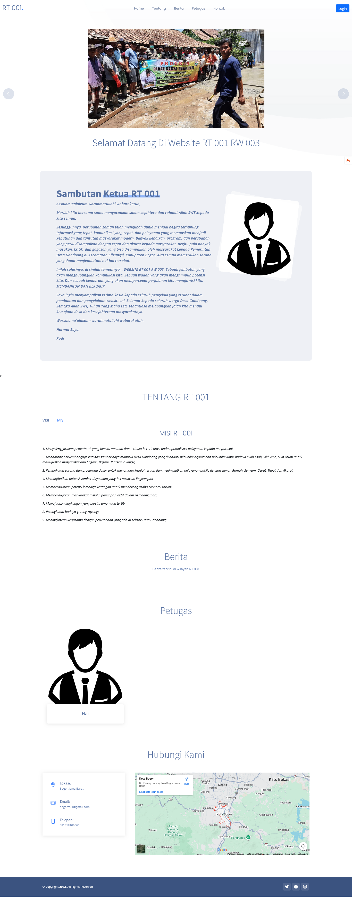
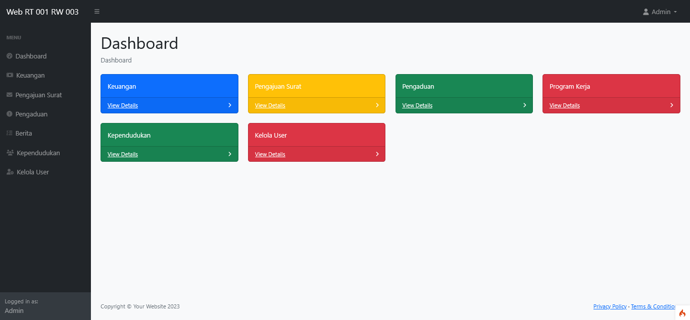
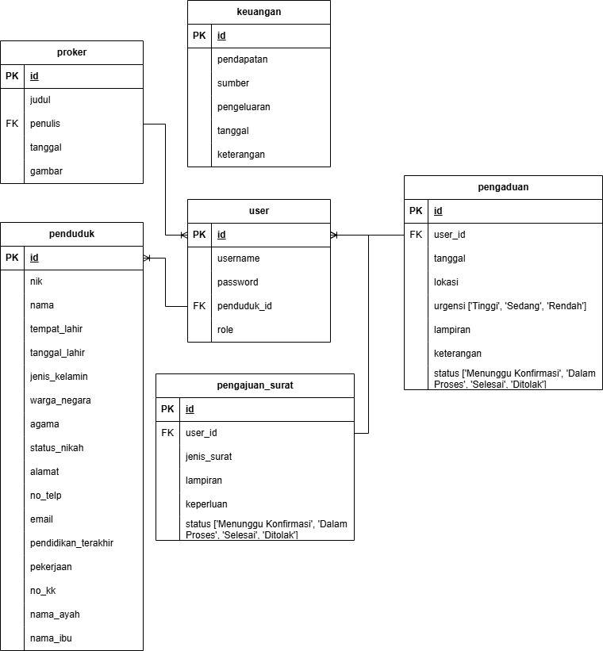
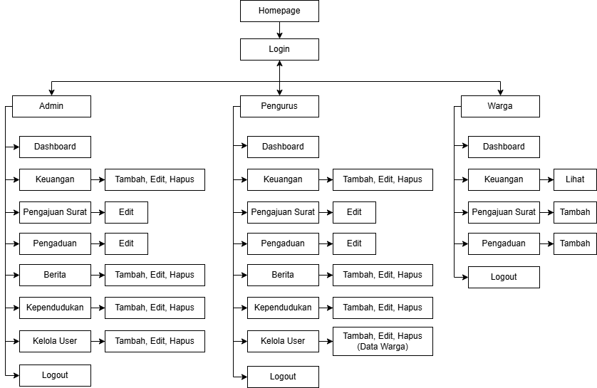

# WEBSITE RT




## Description

This system was developed to support administrative activities at the RT level. It provides an interface for managing resident data, announcements, and user account with responsive design.




## ERD (Entity Relationship Diagram)




## Navigation Structure




## Tools & Technologies

| Technology           | Version         |
|----------------------|-----------------|
| PHP                  | 8.1.10          |
| CodeIgniter          | 4.x             |
| MySQL                | 5.7+            |
| Bootstrap            | 4.0.0           |
| jQuery               | 3.2.1           |
| Local Server (XAMPP/Laragon) | Any     |

## Features
- Multi-role login (Admin, Pengurus, Warga)
- Resident data management (CRUD)
- Financial management
- Letter request submission
- Complaint submission

## Installation

1. clone the project
   ```sh
   git clone https://github.com/nur-fauziyah/website_rt.git
   cd website-rt
   ```
2. Import Database
   - Open **phpMyAdmin**
   - Click **Import**
   - Select the SQL file located in:
     ```sh
     database/db_webrt.sql
     ```

3. Move Project to local server directory
   - If using XAMPP:
     ```sh
     C:\xampp\htdocs\
     ```
   - If using Laragon:
     ```sh
     C:\laragon\www\
     ```
4. Run the local development server
   ```sh
   php spark serve
   ```
   Open in browser
   ```sh
   http://localhost:8080/
   ```

